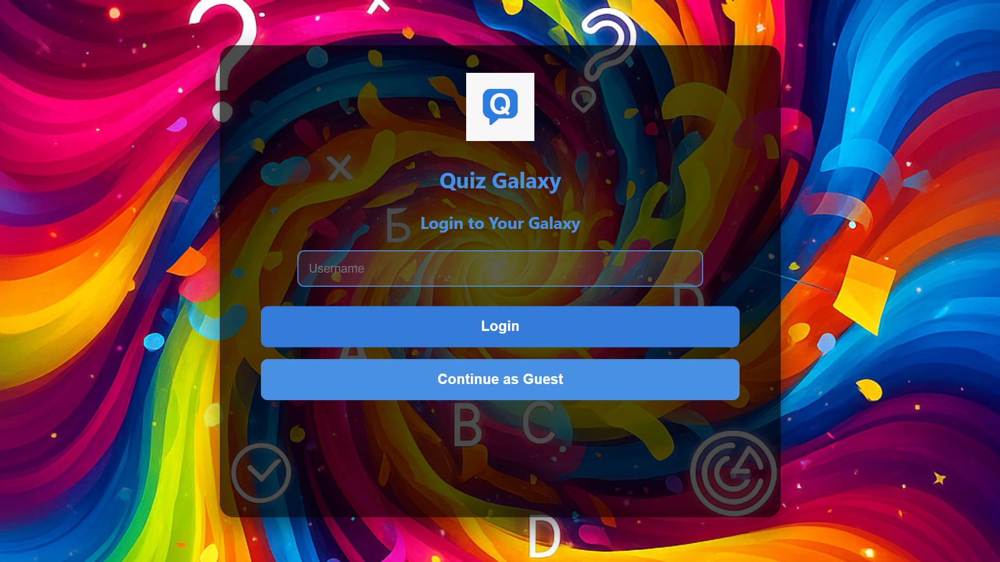
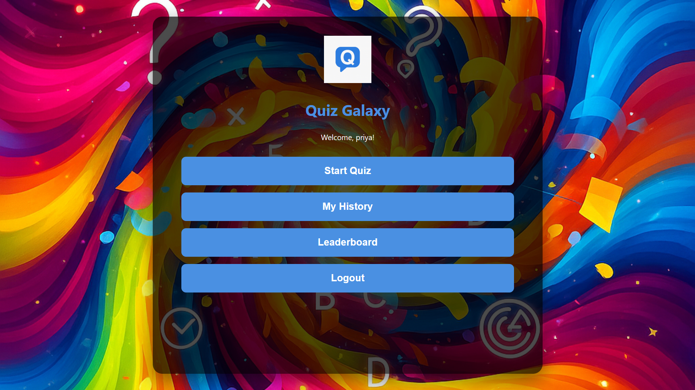
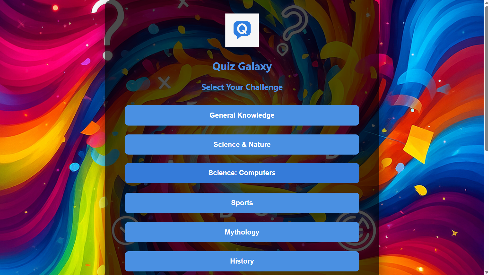
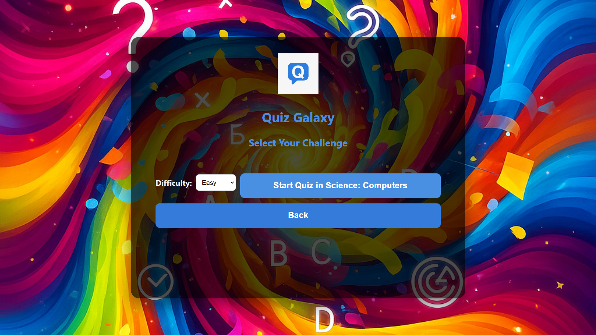
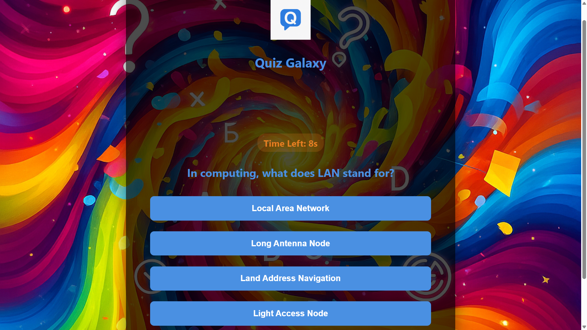
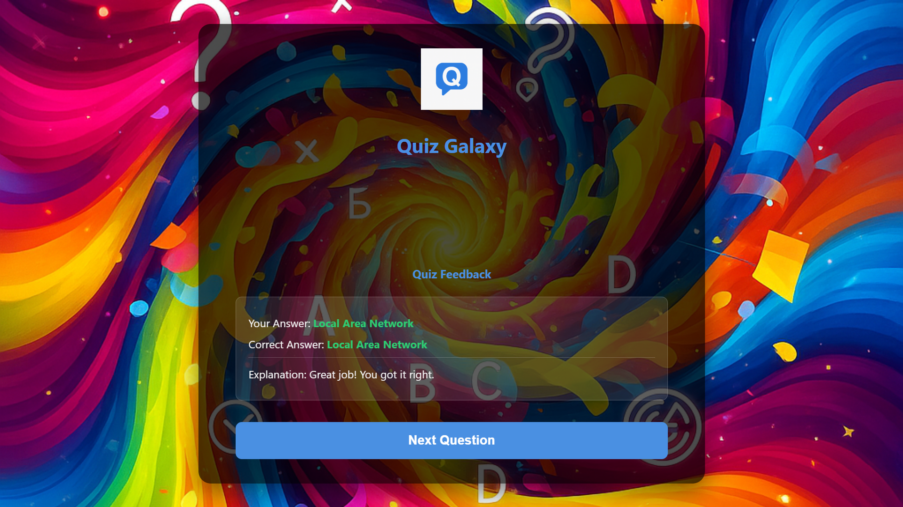
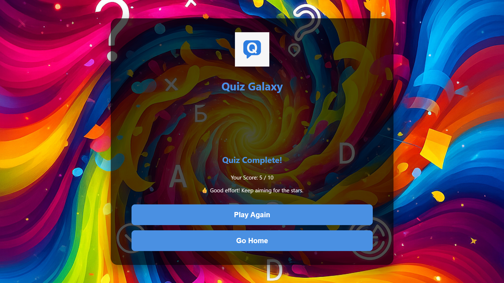

# 🌌 Quiz Galaxy

*A fun and interactive quiz application built using **HTML, CSS, and JavaScript**.  
*This project was developed as part of my **Front-End Developer Internship with Edunet Foundation**.

---

## 🚀 Live Demo
🔗 [Play Quiz Galaxy here](https://vpriya100code.github.io/Quiz_Galaxy/)

---
## 📸 Screenshots
### 🔑 Login Page


### 🏠 Home Page


### 📂 Quiz Domains


### ▶️ Start Quiz Page


### ⏱️ Quiz with Timer


### ✅ Correct Answer Page


### ❌ Incorrect Answer Page


### 🏁 Quiz Results


---

## ✨ Features
- 👤 User login with username or guest mode  
- 🎯 Multiple quiz categories & difficulty levels  
- ⏱️ Timer for each question  
- 📖 Explanation after each question  
- 📊 Score calculation & result page  
- 📜 User history saved in browser  
- 🏆 Leaderboard from all users  

---

## 🛠️ Tech Stack
- **Frontend:** HTML, CSS, JavaScript  
- **Styling:** Custom CSS (responsive, animations, transitions)  
- **API:** [Open Trivia DB](https://opentdb.com/)  

---

## 📂 Project Structure
Quiz_Galaxy/
├── index.html # Main HTML file
├── css/
│ └── style.css # Stylesheet
├── js/
│ └── script.js # Quiz logic
├── assets/
│ └── images/ # App images & screenshots
│ ├── Login_page.png
│ ├── Home_page.png
│ ├── Quiz_Domains.png
│ ├── StartQuiz_page.png
│ ├── QuizWithTimer.png
│ ├── CorrectAnswerpage.png
│ ├── IncorrectAnswer.png
│ └── Quiz_Results.png

## 🚀 Deployment
The app is deployed using **GitHub Pages**.  
Live Link: [Quiz Galaxy](https://your-username.github.io/Quiz_Galaxy/)

## 📌 How to Run Locally
1. Clone this repo:
   ```bash
   git clone https://github.com/VPriya100code/Quiz_Galaxy.git
